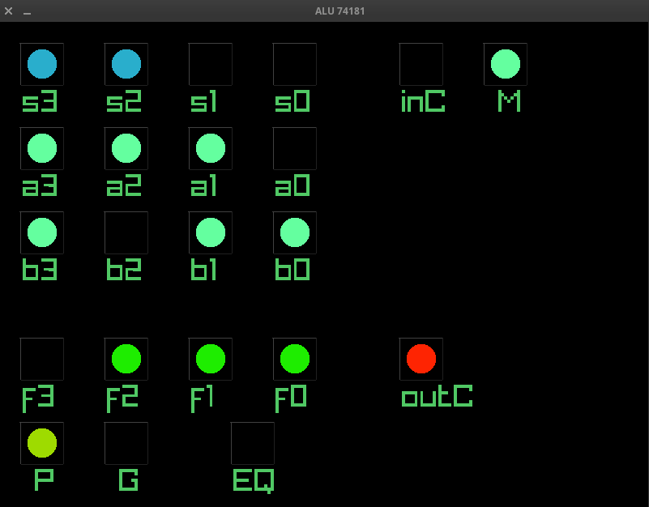

# TealScript


## Preface

The fundamental bottleneck in modern Cyber-Physical Systems (CPS) software is not hardware limitations, but an architectural paradox. Currently, engineering teams are forced to build the entire software stack - ranging from microsecond reflexes to colossal strategic logic - within the same imperative paradigm (like C++). This approach suffocates the system's potential intelligence under the weight of low-level, event-driven, and algorithmically-defined complexity, because such systems are most conveniently described in terms of computing nodes and data paths between those nodes. Using imperative methods, however, requires mapping multiple data flow signals onto a control flow diagram, a very complex and intricate task.

To unlock true scalability and AI integration, the software architecture of any complex mechatronic system must be strictly bifurcated by the principle of separation of concerns based on latency and cognitive load.

 * The Deterministic Reflexive Substrate (The "Spinal Cord"): The lower software layer must be exclusively dedicated to hard real-time execution. Its sole purpose is to instantaneously ingest high-frequency sensor data and drive actuators with microsecond precision. It must remain lightweight, uncompromisingly deterministic, and devoid of business logic.
 * The Cognitive Orchestration Layer (The "Cerebral Cortex"): The upper layer should be latency-tolerant but tasked with managing the huge complexity of the system’s behavioral logic, state machines, and AI integration.

The critical mistake the industry is making today is attempting to build this "Cerebral Cortex" directly in C++. Forcing engineers to weave highly complex, asynchronous business logic and neural network orchestration into a low-level systems language results in skyrocketing development costs, brittle codebases, and stunted vehicle intelligence.

The solution is to decouple the cognitive layer into a specialized, expressive scripting environment - specifically, one built on the Data-flow Graph (DFG) paradigm. A DFG-based engine operates as the strategic brain: it effortlessly consumes the abstracted states from the lower layer, orchestrates complex multi-actuator scenarios, and seamlessly integrates with AI models.

This hybrid topology allows your R&D teams to stop wrestling with memory management and thread synchronization, and instead focus entirely on making the system genuinely intelligent. I have developed exactly this kind of middleware, designed to sit between your hardware abstraction layer inputs and outputs, possibly engaging the AI from time to time, and orchestrating this complex cyber-physical apparatus with unprecedented efficiency.


## TealScript

TealScript is a programmable easy-to-use embedded control system for driving many actuators with command signals produced by parallel analysis of numerous continuously incoming data streams from sensors. Analysis is performed by a network schema written in an embedded programming language. Lightweight and easily integrated with and extensible from C++, the system lets you conveniently combine physical devices, virtual devices, and software components into a single large controllable entity with intelligent behavior. It includes built‑in support for distributed processing over IP networks without requiring any message brokers. It runs without a garbage collector, avoiding periodic GC-induced freezes to reclaim memory. The programming language is intuitive, with a familiar C‑like syntax and rich type system, yet implements the data‑flow graph paradigm and enforces clear declarative rules for composing schemas, which keeps complex logic readable, maintainable and extensible easily. Combined with seamless C++ host extensibility, the result is a cohesive hardware-software ecosystem driven entirely by data-flow graphs.

 * Multiple‑times faster development of complex control schemas compared to the imperative approach.
 * Crafting the schema directly from the list of system requirements.
 * Linear growth of schema complexity proportional to the number of components in the controlled system.
 * Instant script restart after modification without recompiling the host application.
 * Transparent network interaction between scripts on different computer hosts.
 * Easy integration into a C++ application and extension of the scripting engine’s capabilities using C++.


## Data-Flow Graph adoption

While based on the data-centric discrete-time, clocked data-flow static declarative stream functional programming paradigm, TealScript departs from strict functional purity. Each compute node is an instance of an object that syntactically resembles a function, but can retain state between execution cycles via instance variables accessible through the "this" keyword. This makes writing complex state machines or PID controllers as easy as writing simple functions.


## Why TealScript?

The main pitfall when trying to implement a complex logic schema in an imperative style is that the data-flow graph gets mapped onto a control-flow graph. These two graphs are not directly compatible, so you must artificially construct a control-flow graph that matches the data-flow graph. Because the execution-control graph is represented with conditional jumps, the resulting program code becomes much more complicated due to numerous conditional branches. Maintaining and extending such code becomes increasingly difficult as the control schema grows. Thus, the need to move to a more suitable toolset becomes obvious. In addition, it is tempting to specify what the outcome should be, rather than describe how to achieve it step-by-step in detail. While C++ is imperative and requires detailed architectural design, TealScript allows you to broaden your programming approaches without changing your C++ toolchain.

You get a problem-specific tool to handle complex control schemas for multiple actuators based on numerous sensor signals, drastically reducing the low-level C++ boilerplate required for wiring, state management, and multi-threading, while keeping full native extensibility.


## Key Features

 * Intuitive JS-like sytax, conciseness and readability of the program, most of C math functions provided.
 * Zero Dependencies & Portable: Implemented as a custom execution tree interpreter (no LLVM/external lexers). It compiles into any C++17 codebase via CMake and is completely hardware-agnostic.
 * Np Garbage Collector: Data processing in the script and its extensions uses smart pointers for memory management, so the engine is implemented without a Garbage Collector.
 * True Multi-Threading: Execute graph schemas in parallel across available CPU cores. The interpreter safely handles node execution without requiring the user to manage threads and data locking.
 * Turing Complete & Extensible: Handle general-purpose tasks, system interaction, math (functions, matrices), JSON, and custom host-provided types. Easily inject host functions into the scripting runtime. Simple integration, well defined rules of host-script interaction.
 * Partially Stateful, Side Effects: Internally, TealScript's computation nodes are written in conventional imperative code. They are capable of maintaining state across execution cycles and runtime interactions, which allows for precise control over side effects to solve any computational problem.
 * Uniform Function Call Syntax (UFCS), where __func(obj, arg)__ call is fully equivalent of __obj.func(arg)__.
 * Network-Agnostic Distributed Graphs: Seamlessly link variables across different hosts using extern URIs. Built on a custom UDP multiplexing protocol (MTU-safe 1400 bytes) that eliminates Head-of-Line blocking without the overhead of TCP or heavy brokers like MQTT (see [example script](examples/external_value.teal)).


## TealScript in 5 minutes

The TealScript application consists of computational nodes, each of which is an execution unit. Computational nodes are declared as instances of node definitions whose syntax resembles a function declaration. A definition contains an identifier followed by arguments in parentheses (the argument list may be empty), then a body enclosed in braces (braces may be omitted if the body is a single expression). Any computational node may receive, as its arguments, the output values of other nodes, including itself. Nodes execute independently of one another and, on multiprocessor systems, even in parallel. Before executing a node’s body, the values of all its arguments are updated to the current computed values from other nodes. After the node’s body runs, the value returned by the body becomes the node’s output, is provided to other nodes, and the node becomes ready for the next execution cycle, repeating the same actions. Thus, after each completion every computational element restarts with updated arguments, returns a result, and repeats until the application terminates - implementing a clocked, data-oriented system.

Example:

```TealScript
node_definition(arg) {
    println(arg);
    return arg + 1;
}

node_definition node1(node2);
node_definition node2(node1);
```

Note that the number of parameters in a node definition must match the number of actual arguments provided when instantiating that definition.

The proposed language - an implementation of the Data-flow Graph paradigm - introduces a practical modification that eases development at the cost of strict functional purity. That modification is instance-state storage via the keyword this. Unlike local variables, whose values are lost on every restart of a node body, instance variables live as long as the node instance does (i.e., until the application exits). Initially a node has no instance variables, but as identifiers are assigned values during execution, instance variables are created, retain values between restarts, and can be both read and overwritten.

Example:

```TealScript
node_definition() {
    if(this.t == undefined) {
        this.t = timestamp();
    }
    if(this.t.fseconds() + 0.5 < timestamp().fseconds()) {
        this.t = timestamp();
        println(this.t);
    }
    return this.t;
}

node_definition node();
```

In this example this.t holds a timestamp. The language treats an uninitialized instance variable access as undefined, which can be used for one-time initialization. The instance variable this.t is updated every 0.5 seconds. Each node has its own instance variables because each node is a separate instance.

The language is dynamically typed with permissive typing. Supported types include:

bool, char, wchar, string, wstring, s8, u8, s16, u16, s32, u32, s64, u64, f32, f64, float, vec4, mat4, class, array, object.

Type conversions may be implicit or achieved via explicit type casts (prefix or functional style, similar to C).

Example:

```
function Q_rsqrt(x) {
    i = 0x5fe6a09e667f3bcd - (f64(x).as_array_buffer().get_i64_at(0) >> 1);
    y = i.as_array_buffer().get_f64_at(0);
    x2 = (f64)x * 0.5;
    y *= (f64)1.5 - x2 * y * y;
    y *= (f64)1.5 - x2 * y * y;
    y *= (f64)1.5 - x2 * y * y;
    y *= (f64)1.5 - x2 * y * y;
    return y;
}

node_definition() {
    v = 1.0 / Q_rsqrt(900);
    println(v);
    return v;
}

node_definition node();
```

This shows both functional and prefix-style casts. The language supports functions as first-class objects and allows recursion; lambda expressions are not supported.

One of the most important rules is that no declarations/definitions outside node and function definitions are allowed in the source code, keeping the global namespace empty. Host C++ code, however, may add functions and values of various types (including user types, such as the timestamp mentioned earlier) into the runtime global environment, making them accessible from scripts. This enables language extensibility while leveraging fast native code.

The resulting model: the application structure is defined by interconnections between computational nodes and represented by the topology of a static graph, while inside functions and node bodies there is imperative code that may also persist state for nodes (functions do not have per-instance state).

Data exchange with the external environment (the script’s host - the C++ code running the engine) happens via named nodes. For input nodes (from the script’s perspective) the host-provided name is written to the left of the identifier; for output nodes the name is written to the right. Input nodes are not instantiated - an input node simply receives an external value.

Example:

```
'input_val' input;

node_def(in) {
    result = "";
    if(in == undefined) {
        result = "input undefined";
        println(result);
    } else {
        println(in);
        result = "input successfully printed";
    }
    return result;
}

node_def node_inst(input) 'output_string';
```

Here the native code writes an external value under the string name "input_val", which inside the script is available as the identifier "input". The computational node "node_inst" (an instance of "node_def") receives that "input" and returns a string available to native code under the name "output_string", placed to the right of the instance argument list and before the semicolon.

Besides script–host data exchange, scripts can also interact directly across the network for monitoring between scripts by using URLs in the language syntax.

Example:

Server side
```
random_value() {
    return rand();
}

random_value sample_val();
```

Client side
```
extern 'tealscript://hostname:43987/sample_val' remote_value;

print_val(v) {
    console.print("value to print: ", val);
}

print_val sample_val(remote_value);
```

The server script does not itself explicitly expose nodes over the network; the native host must enable the engine’s server capability. The client declares an external node by URL and assigns a local identifier to that value. After that, changes on the remote server are reflected on the client and can be used as ordinary input nodes.


Now we need to look at what the native code looks like.

```C++
#include <tealscript_runtime.hpp>

int main(int argc, char **argv) {
    teal::runtime rt{};

    try {
        if(argc == 2) {
            rt.load_file(args[1]);
        }
        rt.loading_complete();

        if(rt.worker_cells_count() == 0) {
            throw std::runtime_error{"nothing to do - no working elements"};
        }

        rt.start_net_server(teal::net::address_family::inet4, "0.0.0.0", 43987, 0);

        rt.run_mt(std::thread::hardware_concurrency());

        while(true) {
            rt.set_input("hvac_cabin_temp", read_...());
            rt.set_input("hvac_sun_load", read_...());
            rt.set_input("hvac_humidity", read_...());
            rt.set_input("rain_sensor", read_...());
            rt.set_input("light_sensor", read_...());
            rt.set_input("fl_door_stat", read_...());
            rt.set_input("trunk_stat", read_...());
            rt.set_input("hood_stat", read_...());
            rt.set_input("fl_seat_occ", read_...());
            rt.set_input("fl_buckle_stat", read_...());
            rt.set_input("cell_signal_str", read_...());
            rt.set_input("wifi_signal_str", read_...());
            rt.set_input("obd_ignition", read_...());
            ...
            ...
            ...
            ...
            
            
            auto temperature_exceeds_limit{rt.get_output("temperature_exceeds_limit").cast_to_bool()};
            auto collision_pending{rt.get_output("collision_pending").cast_to_bool()};
            auto acc_status{rt.get_output("acc_status").cast_to_json()};
            auto torque_request{rt.get_output("torque_request").cast_to_double()};
            auto esp_intervention{rt.get_output("esp_intervention").cast_to_double()};
            auto damper_force_val{rt.get_output("damper_force_val").cast_to_double()};
            auto hvac_compressor{rt.get_output("hvac_compressor").cast_to_string()};
            auto wiper_speed_val{rt.get_output("wiper_speed_val").cast_to_double()};
            auto hvac_sun_load{rt.get_output("hvac_sun_load").cast_to_double()};
            auto ecu_eng_rpm{rt.get_output("ecu_eng_rpm").cast_to_double()};
            auto ecu_coolant_temp{rt.get_output("ecu_coolant_temp").cast_to_size_t()};
            auto collision_warning{rt.get_output("collision_warning").cast_to_bool()};
            auto precharge_brakes{rt.get_output("precharge_brakes").cast_to_bool()};
            auto motor_torque_fl{rt.get_output("motor_torque_fl").cast_to_double()};
            auto motor_torque_fr{rt.get_output("motor_torque_fr").cast_to_double()};
            auto motor_torque_rl{rt.get_output("motor_torque_rl").cast_to_double()};
            auto motor_torque_rr{rt.get_output("motor_torque_rr").cast_to_double()};
            auto collision_warning{rt.get_output("collision_warning").cast_to_bool()};
            auto precharge_brakes{rt.get_output("precharge_brakes").cast_to_bool()};
            auto cooling_pump_speed_request{rt.get_output("cooling_pump_speed_request").cast_to_double()};
            auto electric_motor_power_limit{rt.get_output("electric_motor_power_limit").cast_to_double()};
            ...
            ...


            // use outputs
            ...
            ...

        }
    } catch(std::exception const &e) {
        std::cerr << "error: " << e.what() << std::endl;
        return 1;
    } catch(...) {
        std::cerr << "unknown error occured" << std::endl;
        return 1;
    }

    return 0;
}
```

It's including the header, creating an instance of the runtime, loading the source file, starting the engine's network server, and in a loop setting input values for the script and reading/using its output values.

In addition to the regulated data exchange between the host C++ code and the script, and the direct network interaction between scripts on different machines, data exchange between computational nodes and the external environment is also possible via extensions, because each node encapsulates imperative code capable of producing side effects. Thus any computational node can read data from disk, network, or memory and return it as its result — so the system’s data-exchange capabilities are not limited to the host application. Input nodes can obtain values on their own, and output nodes can independently write their results anywhere using extensions instead of returning them as their output value.

Example:

```TealScript
input_node() { return data_read_extension.read_some_value(); }
input_node in();

readiness_check_node() { return system_extension.ready_for_output(); }
readiness_check_node ready_for_output();

output_node(input, out_ready) {
    if(out_ready && input != undefined) {
        another_extension.write_some_value(input);
        return true;
    }
    return false;
}
output_node out(in, ready_for_output);
```

In this case input and output nodes do not exchange data with the host code. Essentially, the host code is only needed to start the scripting engine; no data exchange with it is required. The rest of the processing is performed entirely by the script, which uses extension libraries.

Conclusion:

This set of language rules addresses many computational problems. The approach is especially well suited for implementing control schemas and parallel management of many actuators, relays, indicators and other consumers of data based on analysis of multiple parallel input data streams.


## Quick Example

The Bullet Physics engine is used to model a cart with inverse pendulum. All the needed data, in real time, is read from physical simulation and passed to the Scripting Engine Runtime being executing a script. A logical schema, written in TealScript, manages physical simulation by analyzing in parallel the data passed from Bullet Engine and generating control data for the cart virtual actuator:

```TealScript
pass(v) return v;

// Configuration for host code
pass friction_force(.5) 'friction_force';
pass cart_mass(1.) 'cart_mass';
pass pend_mass(.3) 'pend_mass';
pass start_force_impulse(1.) 'start_force_impulse';

balance_pid(angle, dt) { // PID balancing
    if(this.p == undefined) {
        this.p = 0.0;
        this.i = 0.0;
    }
    prev_ang = this.p;
    this.p = angle;
    this.i = dt * this.i + angle;
    d = (angle - prev_ang) / dt;
    return 60.0 * this.p + 20.0 * this.i + 20.0 * d;
}

center_pid(cart_pos, cart_vel) { // Lazy centering
    return abs(cart_pos) < 2.0
        ?
            4.0 * sqrt(abs(cart_pos)) * sign(cart_pos) +
            4.0 * sqrt(abs(cart_vel)) * sign(cart_vel)
        :
            2.0 * sign(cart_pos) + 2.0 * sign(cart_vel);
}

soft_wall(cp) { // "Soft wall"
    return abs(cp) > 4.5 ? sign(cp) * 8.0 : 0.0;
}

mixer(balance_force, center_force, wall_force) { // Mix & clamp
    v = balance_force + center_force + wall_force;
    d = 80.0;
    return v < -d ? -d : v > d ? d : v;
}

// ---------------------------------------------------------
// The Graph
// ---------------------------------------------------------

// inputs from host code
'dt' dt;
'ang' angle;
'cart_pos' cart_pos;
'cart_vel' cart_vel;

// workers
balance_pid balancer(angle, dt);
center_pid centerer(cart_pos, cart_vel);
soft_wall wall(cart_pos);
mixer motor_control(balancer, centerer, wall) 'motor_force';
```

[](https://github.com/dumitrioo/tealscript/blob/main/resources/pid_demo.mp4)

https://github.com/dumitrioo/tealscript/blob/main/resources/pid_demo.mp4

[Example application](examples/pendulum/main.cpp)

## Another Example

How would you implement the following logic circuit in a regular programming language?


And while you are thinking, I will offer you a [solution](examples/alu74181.teal) in a TealScript programming language.

```TealScript
// ---------------------------------------------------------
// logic gates simulation with
// TealScript computation nodes templates
// ---------------------------------------------------------
not(a) { return !a; }
fwd(a) { return (bool)a; }
and2(a, b) { return a && b; }
and3(a, b, c) { return a && b && c; }
and4(a, b, c, d) { return a && b && c && d; }
and5(a, b, c, d, e) { return a && b && c && d && e; }
nand2(a, b) { return !(a && b); }
nand3(a, b, c) { return !(a && b && c); }
nand4(a, b, c, d) { return !(a && b && c && d); }
nand5(a, b, c, d, e) { return !(a && b && c && d && e); }
or2(a, b) { return a || b; }
or3(a, b, c) { return a || b || c; }
or4(a, b, c, d) { return a || b || c || d; }
nor2(a, b) { return !(a || b); }
nor3(a, b, c) { return !(a || b || c); }
nor4(a, b, c, d) { return !(a || b || c || d); }
xor2(a, b) { return a ^ b; }
xor3(a, b, c) { return a ^ b ^ c; }
xor4(a, b, c, d) { return a ^ b ^ c ^ d; }
xnor2(a, b) { return !(a ^ b); }
xnor3(a, b, c) { return !(a ^ b ^ c); }
xnor4(a, b, c, d) { return !(a ^ b ^ c ^ d); }
i2or2(a, b) { return !a || !b; }

// ---------------------------------------------------------
// The Graph
// ---------------------------------------------------------

// inputs --------------------------------------------------
'A0' a0;
'A1' a1;
'A2' a2;
'A3' a3;
'B0' b0;
'B1' b1;
'B2' b2;
'B3' b3;
'S0' s0;
'S1' s1;
'S2' s2;
'S3' s3;
'C_in' c_in;
'M' m;

// workers -------------------------------------------------
not   alu_0(b3);
not   alu_1(b2);
not   alu_2(b1);
not   alu_3(b0);
not   alu_4(m);
and3  alu_5(b3, s3, a3);
and3  alu_6(a3, s2, alu_0);
and2  alu_7(alu_0, s1);
and2  alu_8(s0, b3);
fwd   alu_9(a3);
and3  alu_10(b2, s3, a2);
and3  alu_11(a2, s2, alu_1);
and2  alu_12(alu_1, s1);
and2  alu_13(s0, b2);
fwd   alu_14(a2);
and3  alu_15(b1, s3, a1);
and3  alu_16(a1, s2, alu_2);
and2  alu_17(alu_2, s1);
and2  alu_18(s0, b1);
fwd   alu_19(a1);
and3  alu_20(b0, s3, a0);
and3  alu_21(a0, s2, alu_3);
and2  alu_22(alu_3, s1);
and2  alu_23(s0, b0);
fwd   alu_24(a0);
nor2  alu_25(alu_5, alu_6);
nor3  alu_26(alu_7, alu_8, alu_9);
nor2  alu_27(alu_10, alu_11);
nor3  alu_28(alu_12, alu_13, alu_14);
nor2  alu_29(alu_15, alu_16);
nor3  alu_30(alu_17, alu_18, alu_19);
nor2  alu_31(alu_20, alu_21);
nor3  alu_32(alu_22, alu_23, alu_24);
xor2  alu_33(alu_25, alu_26);
xor2  alu_34(alu_27, alu_28);
xor2  alu_35(alu_29, alu_30);
xor2  alu_36(alu_31, alu_32);
fwd   alu_37(alu_26);
and2  alu_38(alu_25, alu_28);
and3  alu_39(alu_25, alu_27, alu_30);
and4  alu_40(alu_25, alu_27, alu_29, alu_32);
nand5 alu_41(alu_25, alu_27, alu_32, alu_31, c_in);
nand4 alu_42(alu_25, alu_27, alu_32, alu_31)          'P';
and5  alu_43(c_in, alu_31, alu_32, alu_27, alu_4);
and4  alu_44(alu_32, alu_27, alu_32, alu_4);
and3  alu_45(alu_27, alu_30, alu_4);
and2  alu_46(alu_28, alu_4);
and4  alu_47(c_in, alu_31, alu_29, alu_4);
and3  alu_48(alu_29, alu_32, alu_4);
and2  alu_49(alu_30, alu_4);
and3  alu_50(c_in, alu_31, alu_4);
and2  alu_51(alu_32, alu_4);
nand2 alu_52(c_in, alu_4);
nor4  alu_53(alu_37, alu_38, alu_39, alu_40)          'G';
nor4  alu_54(alu_43, alu_44, alu_45, alu_46);
nor3  alu_55(alu_47, alu_48, alu_49);
nor2  alu_56(alu_50, alu_51);
i2or2 alu_57(alu_53, alu_41)                          'C_out';
xor2  alu_58(alu_33, alu_54)                          'f3';
xor2  alu_59(alu_34, alu_55)                          'f2';
xor2  alu_60(alu_35, alu_56)                          'f1';
xor2  alu_61(alu_36, alu_52)                          'f0';
and4  alu_62(alu_58, alu_59, alu_60, alu_61)          'EQ';
```

As you can see, the graph is composed of computation node instances whose implementations described above that graph. And the program itself turned out to be short, understandable and covering the logical circuit one to one.


## Distributed Example

Guess what? Nothing special, just spliting up our application into two parts communicating via the network. To make this possible, we have to turn the network server mode on. After that, ALL the computation nodes of the locally running script are automatically visible from the network.

This is native (for the scripting language) distributed computations - transparent data routing between scripts on different hosts via a fault-tolerant UDP-based protocol, requiring no message brokers. The engine enforces strict architectural boundaries at the language level: for instance, a computational model (ALU 74181) runs in one process and exposes all of its pins to the network, while an independent raylib-based visualizer subscribes via extern URIs directly in the script graph. Decoupled IPC without manual socket management or serialization overhead. Just scripting language syntax.

Ok, lets go ahead.

### Server part

```TealScript
setup_cell() {
    if(!external_values_server_enabled()) {
        if(!enable_external_values_server("0.0.0.0", 43987)) {
            throw error_str(last_error());
        }
    }
    return external_values_server_enabled();
}
setup_cell setup();

// ---------------------------------------------------------
// logic gates simulation with
// TealScript computation nodes templates
// ---------------------------------------------------------
not(a) { return !a; }
fwd(a) { return (bool)a; }
and2(a, b) { return a && b; }
and3(a, b, c) { return a && b && c; }
and4(a, b, c, d) { return a && b && c && d; }
and5(a, b, c, d, e) { return a && b && c && d && e; }
nand2(a, b) { return !(a && b); }
nand3(a, b, c) { return !(a && b && c); }
nand4(a, b, c, d) { return !(a && b && c && d); }
nand5(a, b, c, d, e) { return !(a && b && c && d && e); }
or2(a, b) { return a || b; }
or3(a, b, c) { return a || b || c; }
or4(a, b, c, d) { return a || b || c || d; }
nor2(a, b) { return !(a || b); }
nor3(a, b, c) { return !(a || b || c); }
nor4(a, b, c, d) { return !(a || b || c || d); }
xor2(a, b) { return a ^ b; }
xor3(a, b, c) { return a ^ b ^ c; }
xor4(a, b, c, d) { return a ^ b ^ c ^ d; }
xnor2(a, b) { return !(a ^ b); }
xnor3(a, b, c) { return !(a ^ b ^ c); }
xnor4(a, b, c, d) { return !(a ^ b ^ c ^ d); }
i2or2(a, b) { return !a || !b; }

// ---------------------------------------------------------
// The Graph
// ---------------------------------------------------------

// inputs --------------------------------------------------
'A0' a0;
'A1' a1;
'A2' a2;
'A3' a3;
'B0' b0;
'B1' b1;
'B2' b2;
'B3' b3;
'S0' s0;
'S1' s1;
'S2' s2;
'S3' s3;
'C_in' c_in;
'M' m;

// workers -------------------------------------------------
not   alu_0(b3);
not   alu_1(b2);
not   alu_2(b1);
not   alu_3(b0);
not   alu_4(m);
and3  alu_5(b3, s3, a3);
and3  alu_6(a3, s2, alu_0);
and2  alu_7(alu_0, s1);
and2  alu_8(s0, b3);
fwd   alu_9(a3);
and3  alu_10(b2, s3, a2);
and3  alu_11(a2, s2, alu_1);
and2  alu_12(alu_1, s1);
and2  alu_13(s0, b2);
fwd   alu_14(a2);
and3  alu_15(b1, s3, a1);
and3  alu_16(a1, s2, alu_2);
and2  alu_17(alu_2, s1);
and2  alu_18(s0, b1);
fwd   alu_19(a1);
and3  alu_20(b0, s3, a0);
and3  alu_21(a0, s2, alu_3);
and2  alu_22(alu_3, s1);
and2  alu_23(s0, b0);
fwd   alu_24(a0);
nor2  alu_25(alu_5, alu_6);
nor3  alu_26(alu_7, alu_8, alu_9);
nor2  alu_27(alu_10, alu_11);
nor3  alu_28(alu_12, alu_13, alu_14);
nor2  alu_29(alu_15, alu_16);
nor3  alu_30(alu_17, alu_18, alu_19);
nor2  alu_31(alu_20, alu_21);
nor3  alu_32(alu_22, alu_23, alu_24);
xor2  alu_33(alu_25, alu_26);
xor2  alu_34(alu_27, alu_28);
xor2  alu_35(alu_29, alu_30);
xor2  alu_36(alu_31, alu_32);
fwd   alu_37(alu_26);
and2  alu_38(alu_25, alu_28);
and3  alu_39(alu_25, alu_27, alu_30);
and4  alu_40(alu_25, alu_27, alu_29, alu_32);
nand5 alu_41(alu_25, alu_27, alu_32, alu_31, c_in);
nand4 alu_42(alu_25, alu_27, alu_32, alu_31);
and5  alu_43(c_in, alu_31, alu_32, alu_27, alu_4);
and4  alu_44(alu_32, alu_27, alu_32, alu_4);
and3  alu_45(alu_27, alu_30, alu_4);
and2  alu_46(alu_28, alu_4);
and4  alu_47(c_in, alu_31, alu_29, alu_4);
and3  alu_48(alu_29, alu_32, alu_4);
and2  alu_49(alu_30, alu_4);
and3  alu_50(c_in, alu_31, alu_4);
and2  alu_51(alu_32, alu_4);
nand2 alu_52(c_in, alu_4);
nor4  alu_53(alu_37, alu_38, alu_39, alu_40);
nor4  alu_54(alu_43, alu_44, alu_45, alu_46);
nor3  alu_55(alu_47, alu_48, alu_49);
nor2  alu_56(alu_50, alu_51);
i2or2 alu_57(alu_53, alu_41);
xor2  alu_58(alu_33, alu_54);
xor2  alu_59(alu_34, alu_55);
xor2  alu_60(alu_35, alu_56);
xor2  alu_61(alu_36, alu_52);
and4  alu_62(alu_58, alu_59, alu_60, alu_61);
```

### Client part

```TealScript
/////////////////////////////////////////////////////////////////////////////////
//                             ALU 74181 view (renderer)
/////////////////////////////////////////////////////////////////////////////////
extern 'tealscript://some.host.name.org:43987/s0' s0;
extern 'tealscript://some.host.name.org:43987/s1' s1;
extern 'tealscript://some.host.name.org:43987/s2' s2;
extern 'tealscript://some.host.name.org:43987/s3' s3;
extern 'tealscript://some.host.name.org:43987/a0' a0;
extern 'tealscript://some.host.name.org:43987/a1' a1;
extern 'tealscript://some.host.name.org:43987/a2' a2;
extern 'tealscript://some.host.name.org:43987/a3' a3;
extern 'tealscript://some.host.name.org:43987/b0' b0;
extern 'tealscript://some.host.name.org:43987/b1' b1;
extern 'tealscript://some.host.name.org:43987/b2' b2;
extern 'tealscript://some.host.name.org:43987/b3' b3;
extern 'tealscript://some.host.name.org:43987/c_in' c_in;
extern 'tealscript://some.host.name.org:43987/m' m;
extern 'tealscript://some.host.name.org:43987/alu_61' alu_61;
extern 'tealscript://some.host.name.org:43987/alu_60' alu_60;
extern 'tealscript://some.host.name.org:43987/alu_59' alu_59;
extern 'tealscript://some.host.name.org:43987/alu_58' alu_58;
extern 'tealscript://some.host.name.org:43987/alu_57' alu_57;
extern 'tealscript://some.host.name.org:43987/alu_42' alu_42;
extern 'tealscript://some.host.name.org:43987/alu_53' alu_53;
extern 'tealscript://some.host.name.org:43987/alu_62' alu_62;

///////////////////////// display
ray_window() {
    if(!this.win_created) {
        ray_init_window(800, 600, "ALU 74181");
        ray_set_target_fps(30);
        ray_begin_drawing();
        ray_clear_background(Color(0, 0, 0, 255));
        this.win_created = true;
        this.tid = thread_id();
    }
    if(this.tid == thread_id()) {
        if(ray_window_should_close()) {
            ray_end_drawing();
            ray_close_window();
            exit(0);
        } else {
            if(ray_get_key_pressed() == 300) ray_toggle_full_screen();
            ray_end_drawing();
            ray_begin_drawing();
        }
    }
    return this.tid;
}
color_select() return Color(0x29, 0xae, 0x9cc, 255);
color_in() return Color(0x64, 0xff, 0x9f, 255);
color_out() return Color(0x1e, 0xed, 0x00, 255);
color_carry() return Color(0xfe, 0x24, 0x02, 255);
color_pgeq() return Color(0x9e, 0xdb, 0x00, 255);
draw_bool(t, v, x, y, f, lbl, crcclr) {
    if(t == thread_id()) {
        if(ray_window_should_close()) { ray_close_window(); exit(0); return 0; }
        if(ray_get_key_pressed() == 300) { ray_toggle_full_screen(); }
        rctclr = Color(64, 64, 64, 255);
        rcdclr = Color(32, 32, 32, 255);
        ray_draw_circle(x * f, y * f, 7 * f, v ? crcclr : Color(0, 0, 0, 255));
        ray_draw_text(lbl, (x - 9) * f, (y + 11) * f, 15 * f, Color(80, 200, 100, 255));
        ray_draw_line((x - 10.5) * f, (y - 10) * f, (x + 10) * f, (y - 10) * f, rctclr);
        ray_draw_line((x - 10) * f, (y - 10) * f, (x - 10) * f, (y + 10) * f, rctclr);
        ray_draw_line((x + 10.5) * f, (y + 10) * f, (x + 10) * f, (y - 10) * f, rcdclr);
        ray_draw_line((x + 10) * f, (y + 10) * f, (x - 10) * f, (y + 10) * f, rcdclr);
    }
    return 0;
}

forward(v) return v;

ray_window ray();
forward sfctr(2.6);
color_select clr_s();
color_in clr_in();
color_out clr_out();
color_carry clr_c();
color_pgeq clr_pgeq();
draw_bool dr_c_in(ray, c_in, 200, 20, sfctr, "inC", clr_c);
draw_bool dr_m(ray, m, 240, 20, sfctr, " M", clr_in);
draw_bool dr_s0(ray, s3, 20, 20, sfctr, "s3", clr_s);
draw_bool dr_s1(ray, s2, 60, 20, sfctr, "s2", clr_s);
draw_bool dr_s2(ray, s1, 100, 20, sfctr, "s1", clr_s);
draw_bool dr_s3(ray, s0, 140, 20, sfctr, "s0", clr_s);
draw_bool dr_a0(ray, a3, 20, 60, sfctr, "a3", clr_in);
draw_bool dr_a1(ray, a2, 60, 60, sfctr, "a2", clr_in);
draw_bool dr_a2(ray, a1, 100, 60, sfctr, "a1", clr_in);
draw_bool dr_a3(ray, a0, 140, 60, sfctr, "a0", clr_in);
draw_bool dr_b0(ray, b3, 20, 100, sfctr, "b3", clr_in);
draw_bool dr_b1(ray, b2, 60, 100, sfctr, "b2", clr_in);
draw_bool dr_b2(ray, b1, 100, 100, sfctr, "b1", clr_in);
draw_bool dr_b3(ray, b0, 140, 100, sfctr, "b0", clr_in);
draw_bool dr_f3(ray, alu_61, 20, 160, sfctr, "f3", clr_out);
draw_bool dr_f2(ray, alu_60, 60, 160, sfctr, "f2", clr_out);
draw_bool dr_f1(ray, alu_59, 100, 160, sfctr, "f1", clr_out);
draw_bool dr_f0(ray, alu_58, 140, 160, sfctr, "f0", clr_out);
draw_bool dr_c_out(ray, alu_57, 200, 160, sfctr, "outC", clr_c);
draw_bool dr_p(ray, alu_42, 20, 200, sfctr, " P", clr_pgeq);
draw_bool dr_g(ray, alu_53, 60, 200, sfctr, " G", clr_pgeq);
draw_bool dr_AeB(ray, alu_62, 120, 200, sfctr, "EQ", clr_pgeq);
```



In this example, we can see a several external nodes declarations:

```
extern 'tealscript://localhost:43987/s0' s0;
extern 'tealscript://localhost:43987/s1' s1;
extern 'tealscript://localhost:43987/s2' s2;
...
...
```

These declarations describe the remote host/port/node using the "extern" keyword and a URL, and give a local identifier to each node (which may be the same or different from the remote node). In this example, "localhost" is used for demonstration purposes, but on real systems the host address can be any real host name on the Internet. On the client side, when using external nodes, no additional effort is required to access them, unlike the server side, where, in fact, you need to start the network server from a script. To avoid the need to launch the network server from the script side, this can be done in the host code, when embedding the engine and starting runtime.


## Application & Use Cases

TealScript excels at "sense → compute → act" pipelines: 

 * Robotics & Autonomous Systems: High-throughput signal processing, sensor fusion, and driving actuators in real time.
 * Industrial Automation: Replacing heavy PLC logic with portable C++ integrations.
 * Edge Computing / IoT: Orchestration of distributed controllers without centralized message brokers.
 * Simulations & Digital Twins: Logical linking of separately attached hardware or virtual devices.
     

## Usage & Integration

The usage of library is as simple as following:

1. Include [tealscript_runtime.hpp](src/tealscript_runtime.hpp) header file
2. Instantiate the TealScript runtime object and load scripting sources (from strings or files) into the runtime.
3. Optionally, add your custom C++ functions, variables, types (if any) into the runtime instance.
4. Execute runtime in single/multi-threaded mode exchanging data.


```C++
#include <tealscript_runtime.hpp>

// This C++ code is a host part related to the script example shown earlier

int main(int argc, char **argv) {
    if(argc < 2) {
        return 0;
    }

    // tealscript runtime instance 
    teal::runtime rt{};

    // loading script file passed from command line
    rt.load_file(argv[1]);
    rt.loading_complete();
    
    ...
    ...
    
    while(simulationInProgress) {
        ...
        ...
        // Sensors update
        rt.set_input("dt", dt);
        rt.set_input("ang", angle);
        rt.set_input("cart_pos", cart_x);
        rt.set_input("cart_vel", cart_vel);

        // Compute in the same thread (single-threaded execution)
        rt.run_cycle();
        
        // Fetch controllong value from runtime
        force = rt.get_output("motor_force").cast_to_double();
        
        // Apply script results
        cartBody->applyCentralForce(btVector3(force, 0, 0));
        ...
        ...
    }

    return 0;
}
```

To build the examples (on Linux): 
``` bash 
mkdir build && cd build
cmake ..
make
```

Or use a provided shell script

``` bash 
git clone https://github.com/dumitrioo/tealscript.git
cd tealscript
./build_linux_cmake.sh
```

Explore the [examples](examples/), directory for advanced use cases like the ALU 74181 hardware simulation  and host-side C++ extensions. 


## More Information

For the complete language specification, type system, and host API reference, see the [Documentation](doc/tealscript_overview.pdf). (PDF).
