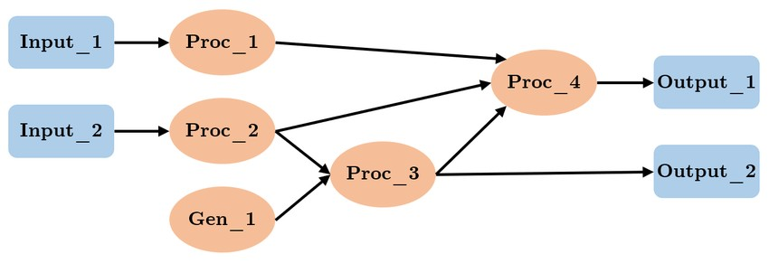
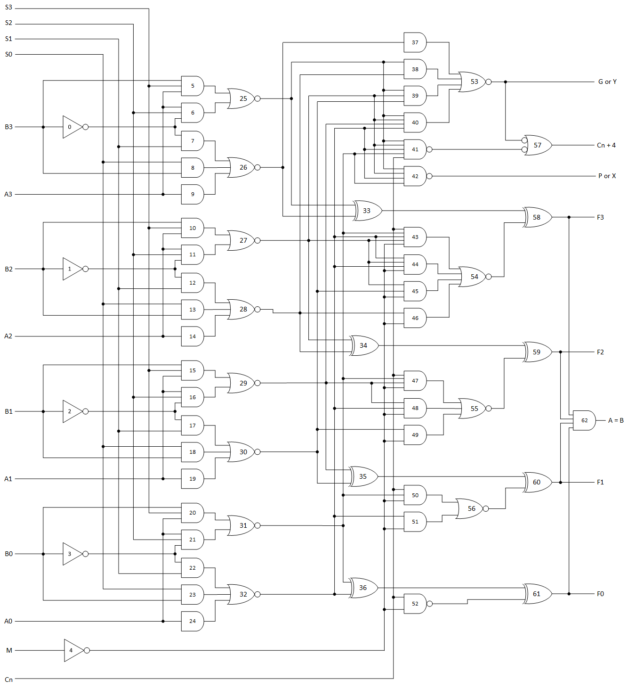
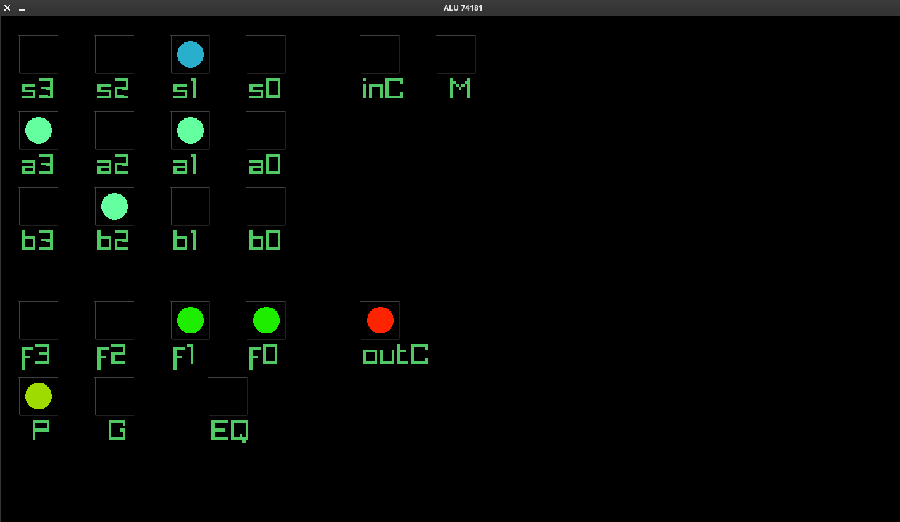

# The SCAFlux Programming Language,

# a Data Flow Graph Paradigm Implementation.

###### D.Yashenkin

```
dmitry.yashenkin@gmail.com
```
## Introduction

## The Data Flow Graph (DFG) paradigm (discrete time, clocked synchronous, modular, data-centric) is a

## declarative pure functional paradigm. It is used to model the flow of data through a system. It is particularly useful in

## fields such as computer science, engineering, and data analysis. For example, neural networks are data-flow graphs.

## Below is a very simplified illustration of the DFG paradigm, covering its structure.


```
Figure 1. DFG system visual representation example.
```
## As many other information systems, DFG-based system performs transformation of input data into the output

## data (computation results). This all is done by using computational nodes connected by data-transferring edges,

## where nodes represent operations and edges represent the data dependencies between operations (Fig. 1). The visual

## description in terms of data flow graphs, made up of computational component “boxes” or “cells” (operations)

## connected by “wires” (variables). It visually depicts how data moves through different processes or operations, making

## it easier to understand and analyze complex systems. A characteristic feature is that computations intended to act on

## whole streams are written as if they were to act on one element at a time. This structure allows for parallel execution

## and optimization of the computational process. For many computation problems a static mapping from input to

## output values is not sufficient; outputs need to change over time according to corresponding changes in inputs

## and/or internal state. At the Figure 1, just a minimalistic schema is given to get the idea. In the real working

## applications, complexity and the size of such schemes could be much larger.

## Key Concepts

## Nodes and Edges:

## Nodes (“boxes”, “cells”) : represent operations, processes, or data storage elements. Each node performs a

## specific function or computation.

## Edges (“wires”) : represent the data flow between nodes. An edge from node A to node B indicates that the

## output of A is used as input for B.

## Each node can have zero or more inputs and exactly one output. A schema in the data flow programming

## paradigm is a directed graph resembling an inverted tree, where the roots located at the end of the data flow are the

## decisions, and the branches located at the beginning receive the input data. In this case, each of the trees responsible

## for a certain sub task can intersect with other trees in terms of data, have nodes looped on themselves and, in the


##### general case, receive data from arbitrary sources, each of which, however, can only be the output of any of the nodes

##### of the current diagram. Each of the computational components - the nodes of the graph - is depicted as a black box

##### that has only one output and, being connected to the outputs of other computational elements, receives an arbitrary

##### number of input values. In this case, the computational element, knowing the type, source and meaning of each of its

##### arguments, operates in its computational block with the actual values supplied from the outputs of other elements. A

##### characteristic feature of this representation is the implicit assumption that the computation of the entire flow must

##### occur element by element, and the memory of the values of previous elements is stored automatically using short-

##### term memory components (either in the black boxes themselves or in the “wires”), which, unlike other components, do

##### not imply instantaneous data transfer.

## Applications

##### Applications range from reactive systems, embedded in a context with user input devices, sensors or

##### communication channels, to processors and generators of time-series data, such as audio signals or dynamic

##### simulations in numerous branches of science and engineering.

##### Programming Languages. DFGs are used in compilers to optimize code by analyzing data dependencies and

##### determining the most efficient order of operations.

##### Digital Signal Processing (DSP). In DSP, DFGs help visualize the flow of signals through various processing

##### stages, aiding in the design and analysis of algorithms.

##### Software Engineering. DFGs can be used to model the flow of data in software applications, helping

##### developers understand how data is transformed and passed through different components.

##### Machine Learning. In machine learning frameworks (like TensorFlow), DFGs represent the flow of data

##### through various layers of a neural network, illustrating how inputs are transformed into outputs.

## Advantages

- Clear visual representation of data flow, making it easier to understand complex systems.
- The data flow graph of the model, is more illuminating with respect to concrete algorithmic details.
- By analyzing the flow of data, developers can identify bottlenecks and optimize performance.
- Extending schema to solve more complex problem can be achieved without modifications of the existing

##### schematic

- Integration of some solutions is done by just connecting it proper by “wires”.
- Parallel processing by highlighting independent operations that can be executed simultaneously.

## Challenges

- Regular, inverse tree-shaped data flow is far more clumsy than in term notations, in particular when non-

##### commutative operators are concerned.

- There is no canonical concept for control issues, such as branching, mode transition, self-configuration,

##### initialization. In terms of data structures, product shape is well-supported, whereas co-product shape is not. It

##### is no coincidence that practical systems often provide a distinct, not fully integrated language layer for this

##### purpose.

- The view is heavily biased towards numeric data and operations; their symbolic counterparts, essential for

##### complex and high-level applications, are treated quite poorly.


## Implementation: the SCAFlux programming language

##### The “SCAFlux” name is an abbreviation and stands for “ S ensor- C ontroller- A ctuator Flux ”. The primary goal was to

##### create a scripting language with a simple, understandable, familiar syntax, based on a declarative data-flow paradigm

##### for concurrency, easily extensible from within host application. The SCAFlux language interpreter is a software library

##### written in C++ that provides the API for embedding into a C++ applications. It was created to be light-weight for

##### embeddability, very easy extensible from within C++, to have zero dependencies from 3-rd party compiler tools and

##### to be complete hardware platform independent. Hardware platform independence is achieved by compiling the script

##### source code into a tree-like execution structure, so neither a virtual machine nor translation into machine code is

##### needed. Declarative Data Flow Graph paradigm is pure functional but presented data flow implementation is partially

##### stateful (which has not impacted the concurrency) providing host application-defined language extensions, side effects

##### and tracking of state. And since the language dictates the global structure of data flows, and the elements are

##### programmed imperatively, there is also control flow at the "micro level", at the level of computation elements bodies

##### contents. Because of possible resulting solution schematic representation complexity, the current implementation’s aim

##### is to maximize definition simplicity for the language building blocks. The language building blocks includes: Cell

##### Template , Cell (corresponds DFG Node) and Function. The cell (computation cell) is also called Computational

##### Element , Computational Node. DFG approach is achieved by the ability to instantiate computation nodes from

##### templates and connect them to each other by passing instances names as the arguments to other instances. Besides

##### this, nothing else needs to be done – after the program is launched, all elements will automatically execute cyclically,

##### receiving updated output values from other elements to which they are connected with each new execution. As the

##### example, we can create possible implementation for the Figure 1 provided at the very first page of this document:

###### // -------------------- cells templates ----------------------

###### duplicate(a) { return a * 2; }

###### square(a) { return a * a; }

###### sum(a1, a2) { return a1 + a2; }

###### mul_add(a1, a2, a3) { return a1 * a2 + a3; }

###### rnd_gen() { return frand() * 100; } // frand() function provided by C++ host application

###### // -------------------- cells instances ----------------------

###### // input cell instances

###### 'Input_1' Input_1;

###### 'Input_2' Input_2;

###### // working cell instances

###### rnd_gen Gen_1();

###### duplicate Proc_1(Input_1);

###### square Proc_2(Input_2);

###### // working cells instances exposed to a host application as outputs

###### sum Proc_3(Proc_2, Gen_1) 'Output_1';

###### mul_add Proc_4(Proc_1, Proc_2, Proc_3) 'Output_2';

##### The language has similar to JavaScript case-sensitive syntax so ID1 and id1 are different names. Computation cells can

##### deal with built-in integral and floating-point numeric types, strings , character types, boolean type, objects , arrays ,

##### vec4 and mat4 types. In addition, it is possible to extend language from within C++ code of the host application with

##### functions and user objects and their bound methods. So, in the code above, the Input_1 and Input_2 elements are

##### the input elements whose values are available to be set from the C++ code by names ‘Input_1’ and ‘Input_2’

##### respectively.


##### The element named Proc_1 is an instance of the template duplicate which on input accepts value from Input_1 , the

##### element Proc_2 is an instance of the template square which on input accepts value from Input_2 , the element Proc_

##### is an instance of the template sum accepting on input two values – one from Proc_2 and another from Gen_1 , the

##### element Proc_4 is an instance of the template mul_add accepting on input three values – from Proc_1 , from Proc_

##### and from Proc_3 , and finally, the element Gen_1 is an instance of the template rnd_gen that does not accept

##### parameters just generating random value in [0..99] range.

##### The Proc_2 and Proc_3 cells are the output cells visible from outside the language runtime (visible from embedding

##### C++ code) by names 'Output_1' and 'Output_2'.

##### Each template for the cells accept the same number of the arguments as the instantiated cell of that template. In

##### programming, this known as formal and actual parameters (formal params are in the template, actual are in the cell

##### instance and they must match). For example, Proc_3 cell accepts two inputs and corresponding sum template also has

##### two parameters. The order of the parameters also matters, so you have to know sequence and meaning of the

##### arguments during instantiation.

##### Note that every element and element template is forward-declared so we can use element name before the definition

##### of it. Also we are free to move all the template definitions to the end of file, after cells definitions. Or we can

##### instantiate cell by template right after that template definition. In simple words, you can make a complete mess of

##### definitions inside your code if you wish (and it will work correctly being correctly implemented besides the absence of

##### the beauty of code).

##### Template body, when encloses just one statement, allowed to omit curly braces.

##### So let’s have some fun rewriting the initial program using a new knowledge about the language code structure:

###### 'Input_1' Input_1;

###### 'Input_2' Input_2;

###### rnd_gen Gen_1();

###### duplicate Proc_1(Input_1);

###### square Proc_2(Input_2);

###### sum Proc_3(Proc_2, Gen_1) 'Output_1';

###### mul_add Proc_4(Proc_1, Proc_2, Proc_3) 'Output_2';

###### /////////////////////////////////////////////////////

###### duplicate(a) return a * 2;

###### square(a) return a * a;

###### sum(a1, a2) return a1 + a2;

###### mul_add(a1, a2, a3) return a1 * a2 + a3;

###### rnd_gen() return frand() * 100;

##### Now the cells definitions are placed first, and the cell templates are at the end of the file for readability. This might be

##### useful when, opening file in text editor, we first want to see a computational elements interconnections, without

##### necessity of scrolling text of the program skipping the templates – they are just the implementation details and we

##### don’t need to deep dive into the templates code.

##### Another thing to be mentioned is a state of the computational elements. Since SCAFlux language is not pure

#### functional, computational elements may have a state and side effects. The state of the element is implemented in the

##### form of access to the internal fields of the elements using keyword this. Initially, cell has no fields. Assigning values to

##### a names within this scope is performed using dot notation. Side effects are possible through the calls to the functions

##### with side-effect (such as I/O functions) from the template bodies. Now, rewrite a program to demonstrate usage of

##### state and side effects:


// input cell instances

'Input_1' Input_1;

'Input_2' Input_2;

// cell templates

stateful_transform(a) {

if(this.stored_val == undefined) this.stored_val = 0;

this.stored_val = (this.stored_val + a) % 10;

return this.stored_val * 2;

}

square(a) return a * a;

sum(a1, a2) return a1 + a2;

muladd(a1, a2, a3) return a1 * a2 + a3;

rnd_gen() return rand() % 10;

// cell instances

stateful_transform Proc_1(Input_1);

square Proc_2(Input_2);

rnd_gen Gen_1();

sum Proc_3(Proc_2, Gen_1) 'Output_1'; // output 1

muladd Proc_4(Proc_1, Proc_2, Proc_3) 'Output_2'; // output 2

// cell template

print_val(label, val) println(label, val); // side effect in form of console output

// cell instances

print_val Prn_3("Proc_3: ", Proc_3);

print_val Prn_4("Proc_4: ", Proc_4);

##### Possible output:

Proc_3: 3

Proc_4: 15

Proc_3: 3

Proc_4: 15

Proc_3: 8

Proc_4: 24

Proc_3: 14

Proc_4: 28

Proc_3: 3

Proc_4: 13

Proc_4: 13

Proc_3: 10

Proc_4: 310

Proc_3: 3

Proc_4: 15

Proc_3: 29

Proc_4: 79


Proc_3: 17

Proc_4: 35

Proc_3: 36

...

##### In this example, we can see both the state usage and the side effects. Proc_1 is now an instance of the

##### stateful_transform template. Inside the body of that template definition, stored_value field is used to keep value

##### between computation cycles. Value stored in that field is used together with an argument to form returned value.

##### Each computational cycle that field value is updated in addition. A print_val template instantiated by Prn_3 and Prn_

##### cells prints their respective input values to the console calling build-in function println.

## C++ Integration

##### To integrate the SCAFlux interpreter capabilities into your C++ application, you need to include header file defining

##### SCAFlux language runtime, create an instance (stack or heap) of the scfx::runtime class, load one or more files/strings

##### containing the source code for your SCAFlux program and call method run_mt() of the runtime object.

##### File first_example.scfx

duplicate(a) return a * 2;
square(a) return a * a;
sum(a1, a2) return a1 + a2;
mul_add(a1, a2, a3) return a1 * a2 + a3;
rnd_gen() return frand() * 100;
'Input_1' Input_1;
'Input_2' Input_2;
rnd_gen Gen_1();
duplicate Proc_1(Input_1);
square Proc_2(Input_2);
sum Proc_3(Proc_2, Gen_1) 'Output_1';
mul_add Proc_4(Proc_1, Proc_2, Proc_3) 'Output_2';

##### File first_example.cpp

###### #include <iostream>

###### #include <thread>

###### #include <chrono>

###### #include <scaflux_runtime.hpp>

###### int main(int argc, char **argv) {

###### scfx::runtime rt{};

###### // load the eample file

###### rt.load_file("first_example.scfx");

###### // signal runtime that loading of files is finished

###### rt.loading_complete();

###### // start execution of the runtime asynchronously in multi-threaded

###### // mode with threads number equal to host’s CPU cores

###### rt.run_mt(std::thread::hardware_concurrency());

###### // update inputs for runtime and read outputs from it displaying in console

###### while(!rt.termination_requested()) {

###### rt.set_input("Input_1", rand() % 1000);

###### rt.set_input("Input_2", rand() % 1000);

###### std::this_thread::sleep_for(std::chrono::milliseconds{500});


###### std::cout << "Output_1 = " << rt.get_output("Output_1") << std::endl;

###### std::cout << "Output_2 = " << rt.get_output("Output_2") << std::endl;

###### }

###### return 0;

###### }

##### In this small but complete example, C++ (host) application creates instance of the SCAFlux runtime, feed it the

##### “first_example.scfx” file containing SCAFlux code and executes it in multi-threaded mode (synchronous single-threaded

##### mode applicable in some cases is available also).

## Extending from C++ Host Code

### Adding Functions

##### File func_injection.cpp

###### #include <iostream>

###### #include <thread>

###### #include <chrono>

###### #include <unistd.h>

###### #include <scaflux_runtime.hpp>

###### int main(int argc, char **argv) {

###### scfx::runtime rt{};

###### // function being injected into the runtime to be available in scripts

###### rt.add_function("hostname", SCFXFUN(fname, args) {

###### std::vector<char> hostname{};

###### hostname.resize(2048);

###### if(gethostname(&hostname[0], hostname.size() - 1) != 0) {

###### return std::string{};

###### }

###### return std::string{hostname.data()};

###### });

###### // injecting a function with an argument

###### rt.add_function("square", SCFXFUN(fname, args) {

###### return args[0] * args[0];

###### });

###### rt.load_file("func_injection.scfx");

###### rt.loading_complete();

###### rt.run_cycle();

###### return 0;

###### }

##### File func_injection.scfx

function_injection_test() {

###### println("host name: ", hostname());

###### println("34.51 squared = ", square(34.51));

}
function_injection_test test();

##### Output:

#### host name: carbon


#### 34.51 squared = 1190.

### Adding Object

##### File object_injection.cpp

###### #include <iostream>

###### #include <thread>

###### #include <chrono>

###### #include <unistd.h>

###### #include <scaflux_runtime.hpp>

###### class my_obj {

###### public:

###### std::string name() const { return name_; }

###### void set_name(std::string const &n) { name_ = n; }

###### private:

###### std::string name_{"default name"};

###### };

###### int main(int argc, char **argv) {

###### scfx::runtime rt{};

###### // object factory function

###### rt.add_function("my_obj", SCFXUN(fname, args) { return scfx::valbox{my_obj{}, "my_obj"}; });

###### // getter

###### rt.add_method("my_obj", "name", SCFXFUN(fname, args) {

###### return args[0].as_class<my_obj>().name();

###### });

###### // setter

###### rt.add_method("my_obj", "set_name", SCFXFUN(fname, args) {

###### args[0].as_class<my_obj>().set_name(args[1].cast_to_string());

###### return args[1].cast_to_string() == args[0].as_class<my_obj>().name();

###### });

###### rt.load_file("func_injection.scfx");

###### rt.loading_complete();

###### rt.run_cycle();

###### return 0;

###### }

##### File object_injection.scfx

object_injection_test() {
o = my_obj();
println("default object name: \"", o.name(), "\"");
o.set_name("new name");
println("new object name: \"", o.name(), "\"");
o.set_name(29);
println("numeric object name: \"", o.name(), "\"");
}


object_injection_test test();

##### Output:

#### default object name: "default name"

#### new object name: "new name"

#### numeric object name: "29"

##### This examples shows how easy it is to extend the capabilities of a scripting language using C++ code.

## Examples

##### Example 1.

##### Consider an extremely simplistic example of a data flow for calculating a mathematical expression like:

### z =( x + y ) × ( a−b )

### Computation nodes:

##### Node 1: Addition (x + y)

##### Node 2: Subtraction (a – b)

##### Node 3: Multiplication ((x + y) * (a – b))

### Edges:

##### An edge from Node 1 to Node 3 (output of addition to multiplication).

##### An edge from Node 2 to Node 3 (output of subtraction to multiplication).

##### In proposed language, this might be implemented as following:

```
Listing 1. The Example 1 implementation.
```
###### plus(arg1, arg2) return arg1 + arg2;

###### minus(arg1, arg2) return arg1 - arg2;

###### multiply(arg1, arg2) return arg1 * arg2;

###### ‘x’ x;

###### ‘y’ y;

###### ‘a’ a;

###### ‘b’ b;

###### plus node1(x, y);

###### minus node2(a, b);

###### multiply node3(node1, node2) ‘z’;

##### Here the “plus”, “minus” and “multiply” are implemented only for demonstration purposes cause everything could be

##### done in a single template.


## Example 2.

## Another example is a quadratic equation:

## ax^2 + bx + c = 0

## the roots of equation are:

## x =

# − b ±√ D

## 2 a

## where

## D = b^2 − 4 ac

## We can write the following code to solve that equation in SCAFlux:

```
Listing 2. The Example 2 implementation.
```
###### // cell templates

###### discriminant(a, b, c) return pow(b, 2) – 4.0 * a * c;

###### x1_tmpl(a, b, d) return d >= 0? (-b + sqrt(d)) / (2.0 * a) : undefined;

###### x2_tmpl(a, b, d) return d > 0? (-b - sqrt(d)) / (2.0 * a) : undefined;

###### num_of_roots(d) return d > 0? 2 : d == 0? 1 : 0;

###### // input cells

###### 'a' a;

###### 'b' b;

###### 'c' c;

###### // worker cells

###### discriminant d(a, b, c);

###### x1_tmpl x1(a, b, d) 'x1'; // \

###### x2_tmpl x2(a, b, d) 'x2'; // ) workers exposed as outputs

###### num_of_roots nr(d) 'num_roots'; // /


### Example 3.

##### Here is more complex example, communication channel controlling script. This will show logical links between

##### different type of values – numeric and boolean. Communicational channel includes two or more participants. In order

##### to correctly use system resources (sockets, CPU time, memory) channel should be managed properly (closed when

##### needed to release resources being consumed for it’s work).

##### Listing in language:

```
Listing 3. The Example 3 implementation.
```
// templates
abandoned(num_connected, initiator_was_connected) {
return num_connected == 0 && initiator_was_connected;
}
nobody_invited_long_time(
num_invited_not_declined,
users_disposition_changed_timeout,
max_timeout_to_invite
) {
return num_invited_not_declined < 2 &&
users_disposition_changed_timeout > max_timeout_to_invite;
}
initial_waiting_for_answer(
answered,
num_connected,
initiator_connected_now,
call_duration,
max_initial_answer_awaiting_seconds
) {
return num_connected == 1 && initiator_connected_now &&
call_duration <= max_initial_answer_awaiting_seconds &&
!answered;
}
initial_waiting_for_answer_too_much(
num_connected,
initiator_connected_now,
answered,
call_duration,
max_initial_answer_awaiting_seconds
) {
return num_connected == 1 &&
initiator_connected_now &&
!answered &&
call_duration > max_initial_answer_awaiting_seconds;
}
one_is_waiting_for_answer_in_group_normally(
num_connected,
answered,
is_group_channel,
users_disposition_changed_timeout,
max_initial_answer_awaiting_seconds
) {
return num_connected == 1 && answered &&
is_group_channel &&


users_disposition_changed_timeout <= max_initial_answer_awaiting_seconds;
}
one_is_waiting_for_answer_in_group_too_much(
num_connected,
answered,
is_group_channel,
users_disposition_changed_timeout,
max_initial_answer_awaiting_seconds
)
return num_connected == 1 && answered && is_group_channel &&
users_disposition_changed_timeout > max_initial_answer_awaiting_seconds;
alone_caller_left_in_nongroup(
num_connected,
answered,
is_group_channel,
users_disposition_changed_timeout,
max_single_call_disconnect_gap_seconds
) {
return num_connected == 1 && answered &&
!is_group_channel &&
users_disposition_changed_timeout > max_single_call_disconnect_gap_seconds;
}
regular_conversation(num_connected) {
return num_connected > 1;
}
can_channel_continue_working(
regular_conversation,
initial_waiting_for_answer,
one_is_waiting_for_answer_in_group_normally,
alone_caller_left_in_nongroup,
abandoned,
one_is_waiting_for_answer_in_group_too_much,
initial_waiting_for_answer_too_much,
nobody_invited_long_time
) {
return (regular_conversation || initial_waiting_for_answer || one_is_waiting_for_answer_in_group_normally) &&
!alone_caller_left_in_nongroup && !abandoned && !one_is_waiting_for_answer_in_group_too_much &&
!initial_waiting_for_answer_too_much && !nobody_invited_long_time;
}
should_channel_shutdown(
abandoned, one_is_waiting_for_answer_in_group_too_much, alone_caller_left_in_nongroup,
initial_waiting_for_answer_too_much, nobody_invited_long_time
) {
return abandoned || one_is_waiting_for_answer_in_group_too_much ||
alone_caller_left_in_nongroup ||
initial_waiting_for_answer_too_much ||
nobody_invited_long_time;
}

// input cells
'connected_users_count' num_connected;
'invited_not_declined_count' num_non_decliners;
'call_duration' call_duration;
'users_disposition_changed_timeout' usrs_changes_timeout;


'initiator_was_connected' init_was_conn;
'initiator_connected_now' init_is_conn;
'answered' answered;
'is_group_channel' is_grp;
'max_initial_answer_awaiting_seconds' max_1st_ans_wait_sec;
'max_timeout_to_invite' invite_timeout;
'max_single_call_disconnect_gap_seconds' disconn_gap_sec;

// worker cells
abandoned abandoned(num_connected, init_was_conn);
nobody_invited_long_time nobody_inv_lt(num_non_decliners, usrs_changes_timeout, invite_timeout);
initial_waiting_for_answer init_wait_answr(answered, num_connected, init_is_conn,
call_duration, max_1st_ans_wait_sec) 'initial_waiting_for_answer';
initial_waiting_for_answer_too_much init_wait_answr_toomuch(num_connected, init_is_conn, answered,
call_duration, max_1st_ans_wait_sec);
one_is_waiting_for_answer_in_group_normally one_waiting_norm(num_connected, answered, is_grp,
usrs_changes_timeout, max_1st_ans_wait_sec);
one_is_waiting_for_answer_in_group_too_much one_waiting_too_much(num_connected, answered, is_grp,
usrs_changes_timeout, max_1st_ans_wait_sec);
alone_caller_left_in_nongroup alone_nongroup(num_connected, answered, is_grp,
usrs_changes_timeout, disconn_gap_sec);
regular_conversation is_regular(num_connected);
can_channel_continue_working can_channel_continue_working(is_regular, init_wait_answr, one_waiting_norm, alone_nongroup,
abandoned, one_waiting_too_much, init_wait_answr_toomuch, nobody_inv_lt);
should_channel_shutdown should_shutdown(abandoned, one_waiting_too_much, alone_nongroup,
init_wait_answr_toomuch, nobody_inv_lt ) 'should_channel_shutdown';


### Example 4.

##### Now let’s try to implement logic of the 74181, a 4-bit slice arithmetic logic unit (ALU), implemented as a 7400

##### series TTL integrated circuit to ensure this is possible case of use for language. The logic for this integrated circuit is

##### as following:


```
Figure 2. ALU 74181 logic.
```
##### In this code, cells templates representing logic gates operating on boolean values.

##### Listing:

```
Listing 4. The Example 4 implementation.
```
not(a) return !a;
buf(a) return a && a;
and2(a, b) return a && b;
and3(a, b, c) return a && b && c;
and4(a, b, c, d) return a && b && c && d;
and5(a, b, c, d, e) return a && b && c && d && e;
nand2(a, b) return !(a && b);


nand3(a, b, c) return !(a && b && c);
nand4(a, b, c, d) return !(a && b && c && d);
nand5(a, b, c, d, e) return !(a && b && c && d && e);
or2(a, b) return a || b;
or3(a, b, c) return a || b || c;
or4(a, b, c, d) return a || b || c || d;
nor2(a, b) return !(a || b);
nor3(a, b, c) return !(a || b || c);
nor4(a, b, c, d) return !(a || b || c || d);
xor2(a, b) return a ^ b;
xor3(a, b, c) return a ^ b ^ c;
xor4(a, b, c, d) return a ^ b ^ c ^ d;
xnor2(a, b) return !(a ^ b);
xnor3(a, b, c) return !(a ^ b ^ c);
xnor4(a, b, c, d) return !(a ^ b ^ c ^ d);
i2or2(a, b) return !a || !b;

scale_factor(v) return v;
ray_window() {
if(!this.win_created) {
ray_init_window(1422, 800, "ALU 74181");
ray_set_target_fps(30);
ray_begin_drawing();
ray_clear_background(Color(0, 0, 0, 255));
this.win_created = true;
}
if(ray_window_should_close()) {
ray_end_drawing(); ray_close_window();
return 0;
}
if(ray_get_key_pressed() == 300) {
ray_toggle_full_screen();
}
ray_end_drawing();
ray_begin_drawing();
ray_clear_background(Color(0, 0, 0, 255));
return this.win_created;
}
color_select() return Color(0x29, 0xae, 0x9cc, 255);
color_in() return Color(0x64, 0xff, 0x9f, 255);
color_out() return Color(0x1e, 0xed, 0x00, 255);
color_carry() return Color(0xfe, 0x24, 0x02, 255);
color_pgeq() return Color(0x9e, 0xdb, 0x00, 255);
draw_bool(v, x, y, f, lbl, crcclr) {
rctclr = Color(64, 64, 64, 255);
rcdclr = Color(32, 32, 32, 255);
ray_draw_circle(x * f, y * f, 7 * f, v? crcclr : Color(0, 0, 0, 255));
ray_draw_text(lbl, (x - 9) * f, (y + 11) * f, 15 * f, Color(80, 200, 100, 255));
ray_draw_line((x - 10.5) * f, (y - 10) * f, (x + 10) * f, (y - 10) * f, rctclr);
ray_draw_line((x - 10) * f, (y - 10) * f, (x - 10) * f, (y + 10) * f, rctclr);
ray_draw_line((x + 10.5) * f, (y + 10) * f, (x + 10) * f, (y - 10) * f, rcdclr);
ray_draw_line((x + 10) * f, (y + 10) * f, (x - 10) * f, (y + 10) * f, rcdclr);
return v;
}
//////////////////////////////// cells instances ////////////////////////////////
// inputs ---------------------------------


'S0' s0;
'S1' s1;
'S2' s2;
'S3' s3;
'A0' a0;
'A1' a1;
'A2' a2;
'A3' a3;
'B0' b0;
'B1' b1;
'B2' b2;
'B3' b3;
'C_in' c_in;
'M' m;

// workers ---------------------------------
not alu_0(b3);
not alu_1(b2);
not alu_2(b1);
not alu_3(b0);
not alu_4(m);
and3 alu_5(b3, s3, a3);
and3 alu_6(a3, s2, alu_0);
and2 alu_7(alu_0, s1);
and2 alu_8(s0, b3);
buf alu_9(a3);
and3 alu_10(b2, s3, a2);
and3 alu_11(a2, s2, alu_1);
and2 alu_12(alu_1, s1);
and2 alu_13(s0, b2);
buf alu_14(a2);
and3 alu_15(b1, s3, a1);
and3 alu_16(a1, s2, alu_2);
and2 alu_17(alu_2, s1);
and2 alu_18(s0, b1);
buf alu_19(a1);
and3 alu_20(b0, s3, a0);
and3 alu_21(a0, s2, alu_3);
and2 alu_22(alu_3, s1);
and2 alu_23(s0, b0);
buf alu_24(a0);
nor2 alu_25(alu_5, alu_6);
nor3 alu_26(alu_7, alu_8, alu_9);
nor2 alu_27(alu_10, alu_11);
nor3 alu_28(alu_12, alu_13, alu_14);
nor2 alu_29(alu_15, alu_16);
nor3 alu_30(alu_17, alu_18, alu_19);
nor2 alu_31(alu_20, alu_21);
nor3 alu_32(alu_22, alu_23, alu_24);
xor2 alu_33(alu_25, alu_26);
xor2 alu_34(alu_27, alu_28);
xor2 alu_35(alu_29, alu_30);
xor2 alu_36(alu_31, alu_32);
buf alu_37(alu_26);
and2 alu_38(alu_25, alu_28);
and3 alu_39(alu_25, alu_27, alu_30);


and4 alu_40(alu_25, alu_27, alu_29, alu_32);
nand5 alu_41(alu_25, alu_27, alu_32, alu_31, c_in);
nand4 alu_42(alu_25, alu_27, alu_32, alu_31) 'P';
and5 alu_43(c_in, alu_31, alu_32, alu_27, alu_4);
and4 alu_44(alu_32, alu_27, alu_32, alu_4);
and3 alu_45(alu_27, alu_30, alu_4);
and2 alu_46(alu_28, alu_4);
and4 alu_47(c_in, alu_31, alu_29, alu_4);
and3 alu_48(alu_29, alu_32, alu_4);
and2 alu_49(alu_30, alu_4);
and3 alu_50(c_in, alu_31, alu_4);
and2 alu_51(alu_32, alu_4);
nand2 alu_52(c_in, alu_4);
nor4 alu_53(alu_37, alu_38, alu_39, alu_40) 'G';
nor4 alu_54(alu_43, alu_44, alu_45, alu_46);
nor3 alu_55(alu_47, alu_48, alu_49);
nor2 alu_56(alu_50, alu_51);
i2or2 alu_57(alu_53, alu_41) 'C_out';
xor2 alu_58(alu_33, alu_54) 'f3';
xor2 alu_59(alu_34, alu_55) 'f2';
xor2 alu_60(alu_35, alu_56) 'f1';
xor2 alu_61(alu_36, alu_52) 'f0';
and4 alu_62(alu_58, alu_59, alu_60, alu_61) 'EQ';

// servicing cells ---------------------------------
ray_window rwnd();
scale_factor fctr(3.0);
color_select clr_s();
color_in clr_in();
color_out clr_out();
color_carry clr_c();
color_pgeq clr_pgeq();
draw_bool dr_c_in(c_in, 200, 20, fctr, "inC", clr_c);
draw_bool dr_m(m, 240, 20, fctr, " M", clr_in);
draw_bool dr_s0(s3, 20, 20, fctr, "s3", clr_s);
draw_bool dr_s1(s2, 60, 20, fctr, "s2", clr_s);
draw_bool dr_s2(s1, 100, 20, fctr, "s1", clr_s);
draw_bool dr_s3(s0, 140, 20, fctr, "s0", clr_s);
draw_bool dr_a0(a3, 20, 60, fctr, "a3", clr_in);
draw_bool dr_a1(a2, 60, 60, fctr, "a2", clr_in);
draw_bool dr_a2(a1, 100, 60, fctr, "a1", clr_in);
draw_bool dr_a3(a0, 140, 60, fctr, "a0", clr_in);
draw_bool dr_b0(b3, 20, 100, fctr, "b3", clr_in);
draw_bool dr_b1(b2, 60, 100, fctr, "b2", clr_in);
draw_bool dr_b2(b1, 100, 100, fctr, "b1", clr_in);
draw_bool dr_b3(b0, 140, 100, fctr, "b0", clr_in);
draw_bool dr_f3(alu_61, 20, 160, fctr, "f3", clr_out);
draw_bool dr_f2(alu_60, 60, 160, fctr, "f2", clr_out);
draw_bool dr_f1(alu_59, 100, 160, fctr, "f1", clr_out);
draw_bool dr_f0(alu_58, 140, 160, fctr, "f0", clr_out);
draw_bool dr_c_out(alu_57, 200, 160, fctr, "outC", clr_c);
draw_bool dr_p(alu_42, 20, 200, fctr, " P", clr_pgeq);
draw_bool dr_g(alu_53, 60, 200, fctr, " G", clr_pgeq);
draw_bool dr_AeB(alu_62, 120, 200, fctr, "EQ", clr_pgeq);

##### Below is the image displaying script work result. As you can see, only a few lines of code is used for debug drawing

##### that picture (again, which is side-effect). During the execution process, this script randomly changes the input values


##### and provides calculated output values set depending on input. The main circuit schema logic is directly reflected to

##### the scripting code: each circuit element (from Fig. 2) corresponds to a single element of the script. And each run cycle

##### they do the work of calculating the resulting set of values. This example also shows extendability of the system: in this

##### case RayLib has been used as the extension for the purposes of visualization.


```
Figure 3. Displaying input/output values of working data flow system emulating ALU74181 logical cirquit.
```

### Example 5.

##### Despite that the proposed implementation language program overall structure is DFG paradigm-based, the individual

##### computing elements templates are programmed with the imperative code. Now is time to see the imperative aspect

##### of the language. Consider such a problem in order to get acquainted with the imperative possibilities of programming

##### computing elements:

##### Sheldon, Leonard, Penny, Rajesh, and Howard are standing in line at a Double Cola vending machine; there are no

##### other people in line. The first person in line (Sheldon) buys a can, drinks it, and becomes two! The resulting two

##### Sheldons join the back of the line. Then the next person in line (Leonard) buys a can, drinks it, and joins the back of

##### the line as a double, and so on. This process continues ad infinitum.

##### Write a program that, by a given arbitrary serial step number N, finds which character's copy it is to take a drink at

##### the given step.

##### Below is the solution for this problem:

```
Listing 4. The Example 5 implementation.
```
function serialize_tbbt_array(a) {
res = "[";
sep = "";
for(i = 0; i < a.size(); ++i) {
for(n = 0; n < a[i].num; ++n) {
res += sep + a[i].name;
sep = ", ";
}
}
res += "]";
return res;
}
tbbt(n) {
if(n > 0) {
println("Target step number: ", n);
a = array();
a[0].name = "Sheldon"; a[0].num = 1;
a[1].name = "Leonard"; a[1].num = 1;
a[2].name = "Penny"; a[2].num = 1;
a[3].name = "Rajesh"; a[3].num = 1;
a[4].name = "Howard"; a[4].num = 1;
for(i = 1; i < n; ++i) {
--a[0].num;
pf = a[0];
if(pf.num <= 0) {
a.pop_front();
}
last = a.size() - 1;
if(a[last].name == pf.name) {
a[last].num += 2;
} else {
t = object();
t.num = 2;
t.name = pf.name;
a.push_back(t);
}


}
println("The character to take a drink at step ", n, " is \"", a[0].name, "\"");
println("Current queue state: ", serialize_tbbt_array(a));
println();
} else {
println("wrong argument: ", n);
}
return 0;
}
seq_gen() {
if(this.curr == undefined) { this.curr = 0; }
if(this.curr >= 10) { exit(0); }
return ++this.curr;
}
seq_gen sqg();
tbbt duplicating_beverage(sqg);

##### And the outputs is as follows:

Target step number: 1
The character to take a drink at step 1 is "Sheldon"
Current queue state: [Sheldon, Leonard, Penny, Rajesh, Howard]

Target step number: 2
The character to take a drink at step 2 is "Leonard"
Current queue state: [Leonard, Penny, Rajesh, Howard, Sheldon, Sheldon]

Target step number: 3
The character to take a drink at step 3 is "Penny"
Current queue state: [Penny, Rajesh, Howard, Sheldon, Sheldon, Leonard, Leonard]

Target step number: 4
The character to take a drink at step 4 is "Rajesh"
Current queue state: [Rajesh, Howard, Sheldon, Sheldon, Leonard, Leonard, Penny, Penny]

Target step number: 5
The character to take a drink at step 5 is "Howard"
Current queue state: [Howard, Sheldon, Sheldon, Leonard, Leonard, Penny, Penny, Rajesh, Rajesh]

Target step number: 6
The character to take a drink at step 6 is "Sheldon"
Current queue state: [Sheldon, Sheldon, Leonard, Leonard, Penny, Penny, Rajesh, Rajesh, Howard, Howard]

Target step number: 7
The character to take a drink at step 7 is "Sheldon"
Current queue state: [Sheldon, Leonard, Leonard, Penny, Penny, Rajesh, Rajesh, Howard, Howard, Sheldon, Sheldon]

Target step number: 8
The character to take a drink at step 8 is "Leonard"
Current queue state: [Leonard, Leonard, Penny, Penny, Rajesh, Rajesh, Howard, Howard, Sheldon, Sheldon, Sheldon,
Sheldon]

Target step number: 9
The character to take a drink at step 9 is "Leonard"
Current queue state: [Leonard, Penny, Penny, Rajesh, Rajesh, Howard, Howard, Sheldon, Sheldon, Sheldon, Sheldon,
Leonard, Leonard]

Target step number: 10
The character to take a drink at step 10 is "Penny"
Current queue state: [Penny, Penny, Rajesh, Rajesh, Howard, Howard, Sheldon, Sheldon, Sheldon, Sheldon, Leonard,
Leonard, Leonard, Leonard]

##### Actually, single computation element like duplicating_beverage in the above program could be used as the

##### imperative program resembling main() function of the C language. But interaction between the cells forms a

##### computation network which is declarative data flow, functional.


### Example 6.

##### Another example of general purpose computations on a single cell, a Fractal Demo in SCAFlux (adapted from a Wren

##### version by Robert Nystrom):

```
Listing 5. The Example 6 implementation.
```
fractal_tempate() {
yMin = -0.2;
yMax = 0.1;
xMin = -1.5;
xMax = -1.1;
for (yPixel = 0; yPixel < 40; yPixel++) {
y0 = (yPixel / 40.0) * (yMax - yMin) + yMin;
for (xPixel = 0; xPixel < 79; xPixel++) {
x0 = (xPixel / 78.0) * (xMax - xMin) + xMin;
x = x0; y = y0;
pixel = ' ';
for (iter = 0; iter < 80; iter++) {
xx = x * x - y * y + x0;
yy = 2.0 * x * y + y0;
x = xx; y = yy;
if (x * x + y * y > 4.0) {
pixel = " .:;+=xX$&"[iter / 8];
break;
}
}
print(pixel);
}
println();
}
exit(); // terminate system execution
return 0;
}
fractal_tempate fractal_inst();

##### And, of course, the output:

.................+::;:;;;+ ...::........:....:+=++;
....:;.......;::.:::+X ......::..:::;;=:;:::;
.........:++x+ +; X;;. ............:=$= +
:... ...........:&;;+X ....:.. .............:::X
...:...... ...............::;;=x ...:.......... ...............::::; =
...:::........................;:..:;=;; .....:.............:...........::+= x
......;...........+;.............:+& .......:...........;:............:::+=
........;:::.......::..........:::;=+ ........:x:......::+::..;:....::;&
........:;::::::::+;::::;::::::::;+ .........:;;;;;+::::; =;++::;::::=
.........:::;+x$ ; +X ++x xX::::;= ............::;+ x +;:;;=
..............;.....:::::;+X =;;;x ................::.....:;;;+X &&+
...:..............+::.:::; = ...:..............:+::::; $
..........:.......::=;=++= ....;.:...;....:::;;;x x
...x;+:.::+:::::+;;+ :+::x :::x;::::;+;;x
....;::...:....::::;$$ ....:.....;....:..::+++===
..................:;;:;;;+ ...;..............:;:::::;+ =
................;=.....:;=+=x ++& .:.............:.....:;:::;;= X+;+
............:;= $ $;X;; ...........::;; =+ = x= $+;:x::;
.........:;=+==+x:;;;xX=;&;:&::::; .....:::;+:::;;:::;+; :=X:::::::: =
........;=:..::..:: +:.:;:...::::XX ........:;;........: :.........:;:x&

##### The ability to perform general-purpose computations is the foundation of the operation of computational cells in a

##### data flow processing graph. As is known, any functional programming language hides low-level imperative capabilities

##### under the hood, thanks to which it is possible to describe the solution scheme of a computational problem in a


##### declarative style. The SCAFlux is a hybrid, partially stateful implementation combining declarative and imperative

##### possibilities in well balanced ratio to allow developer to program a complex schemes keeping program in tight inter-

##### operation with host system.

## Conclusion

##### Data Flow Graph Paradigm is a powerful tool for visualizing and analyzing the flow of data in various systems.

##### It helps in understanding dependencies, optimizing performance, and facilitating parallel processing. Whether in

##### programming, digital signal processing, or machine learning, Declarative Data Flow Graph parallel Paradigm play a

##### crucial role in the design and analysis of complex systems. This approach allows us to obtain powerful capabilities

##### based on the scheme in a compact and quite readable form. If the analysis of all input data was performed in an

##### imperative style inside the flow, branched garlands of if-expressions nested inside each other would end up in the

##### place of the scheme recalculation call. As already mentioned, the weak point of the scheme is the coupling of

##### imperative code with the data flow. You can see what awkward and cumbersome expressions are obtained during

##### inter-module data exchange and, as a result, inside the function body. It is worth noting that as the scheme grows,

##### the complexity of processing increases linearly at most, which could not be said when processing multiple input values

##### with imperative code. The combining of the two paradigms is not syntactically seamless, indicating that we are trying

##### to merge two worlds. However, the benefits of such a merger outweigh the effort of fusion. And the showed

##### implementation allows simple embedding into C++ code. Interacting between C++ and Data Flow Language runtime

##### is also very simple and straightforward. Essentially, DFG is a way computing elements are communicating with each

##### other during computational process. Every system is built on top of some rules of interaction between building blocks.

##### In the DFG such rule set are:

- Programmable computing elements templates.
- Template is a stateful object definition represented by function consuming arguments and returning a value.
- Each input element is associated with the name visible from the outside the language runtime.
- Each computing element is an instance of the mentioned earlier template. Arguments of the template and the

##### instance of that template corresponds.

- Each computing element has zero or more inputs.
- Each computing element has exactly one output.
- Each computing element’s output may be used as the input by this or any number of any other elements.
- Discrete time, clocked synchronous.

##### These rules are powerful enough to allow build systems solving many of the tasks much more effectively than

##### the other programming paradigms.

##### Proposed implementation of the language has small footprint with meaning to be used in small or embedded

##### computing systems.


